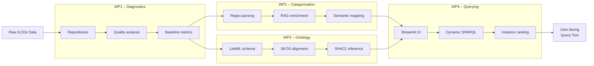

# LCA Data Harmonization Pipeline

This project supports the harmonization of heterogeneous ILCD-based LCA data (including EPDs) into a semantic knowledge graph using LinkML, SKOS, and SHACL. It enables structured querying across material classifications, indicators, and regulatory systems (e.g., DIN 276). The Streamlit prototype provides an accessible front-end for early-stage building design decisions. This work was developed as part of a master's thesis at RWTH Aachen University.

The repository includes both semantic modeling and harmonization workflows (via LinkML and RDF) and a secondary pipeline (`pipeline2/`) that explores category extraction and vector-based retrieval.

## Demo

https://github.com/user-attachments/assets/d0d76de3-7c82-4ea8-a346-ef030aa3451c

The video shows querying ILCD datasets filtered by ready-mix concrete category, DIN 276 cost groups, country codes, dataset type and GWP/PENRT values, using the Streamlit UI.

## Methodology Overview

The diagram below shows the semantic harmonization pipeline used in this project:



## Directory Overview

```

.
├── linkml/        # Scripts and notebooks for LinkML transformation
├── data/          # Generated schemas and examples
├── pipeline2/     # Experimental notebooks for LLM-based harmonization
└── prototype/     # Streamlit demo app

```

## Detailed Contents

### `linkml/`

- **00-1_epd_json_rename_keys.py** – Cleans and restructures raw EPD/LCA JSON files, renaming problematic keys and removing unwanted elements.
- **00-2_epd_json_assign_ids.py** – Assigns stable identifiers to cleaned JSON using patterns from the consolidated LinkML YAML ILCD schema.
- **01_pipeline_epd-json-to-linkml-ilcd-schema.ipynb** – Generates Python dataclasses from LinkML YAML and produces an LinkML YAML ILCD schema.
- **02_pipeline_epd-json-to-rdf.ipynb** – Converts raw JSON from LCA datasets to RDF based on the LinkML YAML ILCD schema.
- **03_postprocess_epd-rdf-add-skos.ipynb** – Normalizes namespaces in the generated RDF and adds SKOS concepts.
- **04_postprocess_epd-rdf-infer-triples-shacl.ipynb** – Uses pySHACL to infer and clean triples before final serialization.
- **linkml-env.yml** – Conda environment file for running the above scripts.

### `data/linkml/`

Artifacts generated from the LinkML pipeline:

- `yaml/*.yaml` – LinkML schemas (e.g., `linkml_processInformation_schema.yaml`).
- `py/*.py` – Auto-generated Python dataclasses.
- `rdf/*.ttl` – RDF files including SHACL shapes and example data in Turtle syntax.

### `pipeline2/`

Experimental notebooks for semantic enrichment and retrieval:

- **notebooks/p2_data_preparation.ipynb** – Extracts category information from a SQL database.
- **notebooks/p2_regex_classification.ipynb** – Rule‑based keyword classification for identifying concrete-related EPDs.
- **notebooks/p2_din276_matching.ipynb** – Tests semantic mapping to DIN 276 cost groups.
- **notebooks/p2_category_matching.ipynb** – Manual review of unmatched results from the rule-based pipeline.
- **notebooks/p2_vector_store_creation.ipynb** – Constructs vector stores from XML-based category hierarchies.
- **notebooks/p2_model_evaluation.ipynb** – Evaluates various embedding models for performance and relevance.
- **notebooks/p2_reranker_evaluation.ipynb** – Experimental reranker model evaluation (preliminary results did not outperform simpler methods).
- **notebooks/p2_data_prep_model_evaluation.ipynb** – Cleans dataset names to prepare them for model evaluation.
- **notebooks/p2_summarization_tests.ipynb** – Tests automated summarization of EPD technology descriptions.
- **pipeline2-env.yml** – Conda environment file for this notebook series.

### `prototype/`

Streamlit application for querying harmonized EPD and LCA data:

- **app.py** – Entry point; registers pages and initializes the UI.
- **query_page.py** – Builds sidebar controls and runs SPARQL queries.
- **sparql_query_building.py** – Constructs structured SPARQL queries based on user-selected filters.
- **sparql_utils.py** – Utility functions for querying the local Fuseki SPARQL endpoint.
- **display_utils.py** – Displays results, including ranking indicators and statistical visuals.

To run the prototype locally:

```bash
streamlit run prototype/app.py
```

## Prerequisites

- **Ollama**: Required for running local embedding models. Download from [ollama.com](https://ollama.com/download) and start with `ollama serve`.
- **SPARQL Triplestore**: The Streamlit app expects a SPARQL endpoint at `http://localhost:3030`. Apache Jena Fuseki is recommended. Download from [jena.apache.org](https://jena.apache.org/download/index.cgi), unzip, and run `fuseki-server`.
- **OpenAI API Key**: Required for selected notebooks in `pipeline2/`.
  Create a `.env` file in the project root with the following content:

```env
OPENAI_API_KEY=your-key-here
```

The key will be automatically loaded using `python-dotenv`.

## Getting Started

Create and activate a conda environment using one of the following:

```bash
conda env create -f linkml/linkml-env.yml
conda activate linkml-env
```

or

```bash
conda env create -f pipeline2/pipeline2-env.yml
conda activate pipeline2-env
```

Once the environment is active, follow the `linkml/` pipeline to generate RDF from EPD JSON, or use the `pipeline2/` notebooks to explore semantic categorization and model-based evaluation.

> The `linkml-env` environment is also required to run the Streamlit prototype in `prototype/`.

## Notes

- The SPARQL endpoint is hardcoded as `http://localhost:3030/EPD_RDF/sparql` in `prototype/sparql_utils.py`.

## Data Availability

Due to licensing restrictions, the original EPD and LCA datasets used for this project are not included in the public repository. Only derived metadata and schema artifacts are shared here. If you are interested in the original data used for harmonization and evaluation, feel free to contact me directly.
